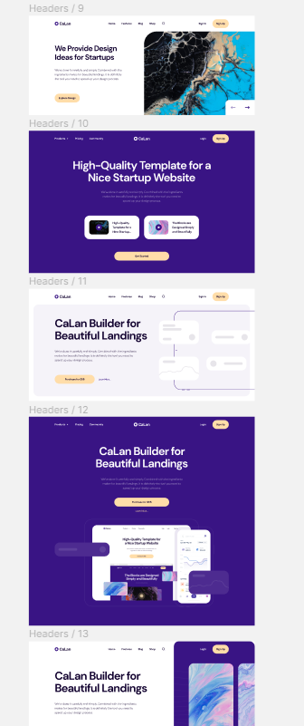
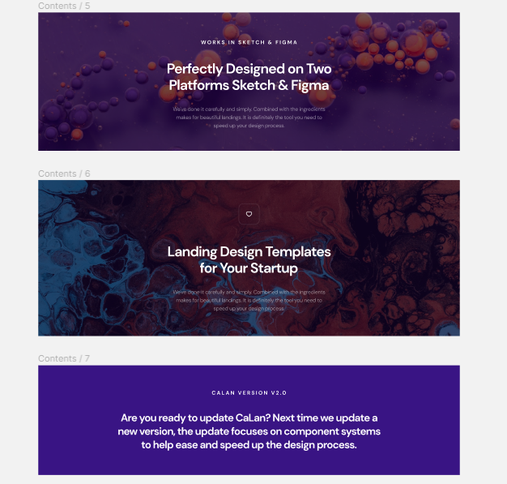
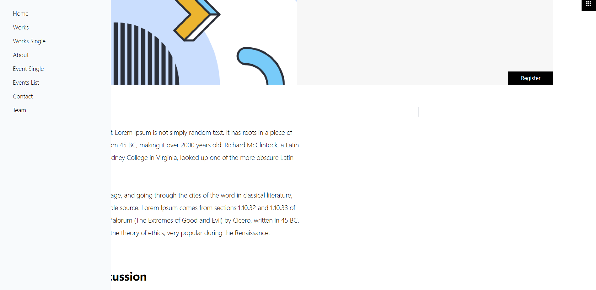
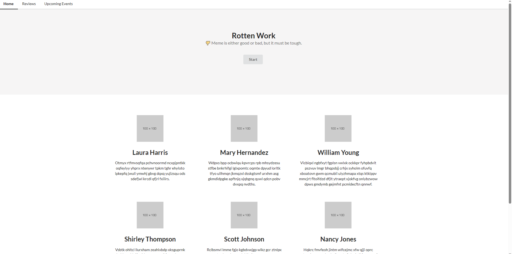
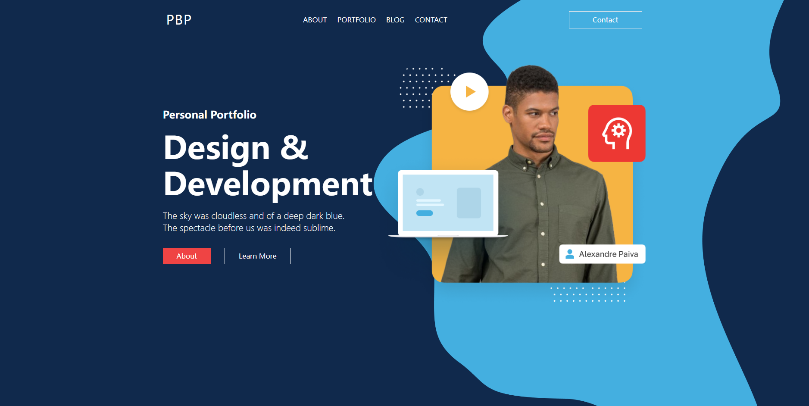
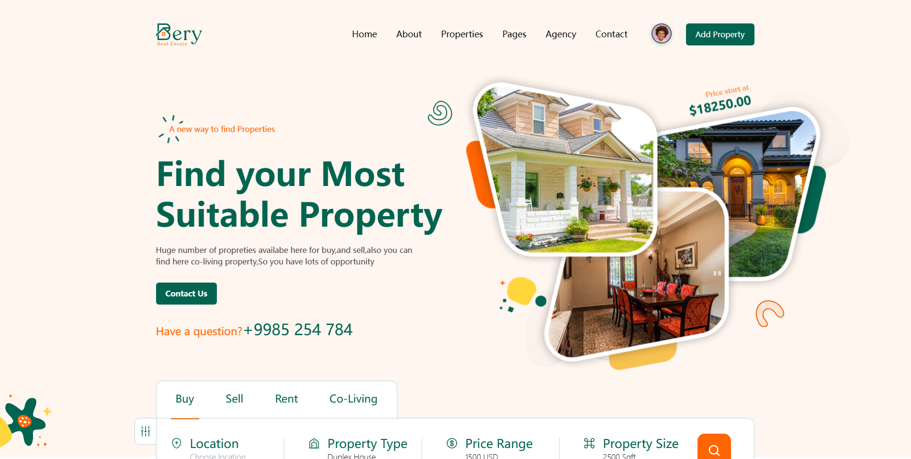

# Rotten Work

烂活项目，充斥着各种烂活，是我的垃圾web项目集合体，个人自娱自乐用的，以编写web组件，layout主页，landing主页为主。
框架混杂，以React为主，使用过
- umi.js
- umi.js + qiankun 写微前端（为了微前端而微前端，脱离实际业务，就是体验）
- koa项目
- create-react-app
未来可能尝试 meteor 和 next，也可能加入uniapp项目和vue项目。看我高兴写到哪里吧。


下属项目中，没有展示图片的就是没写好的、或者只建立了文件夹占位置的

---

## admin-template
管理端模板， create-react-app + material ui + styled-components

---

## calan
参照figma写的layout官网展示组件，包含官网网站的各个组件，可以直接组合拼接成一个网站。
是一个物料和组件展示项目。

内涵一个有趣的demo，尚未优化，灵感源自于低代码，通过json生成网站页面。

部分figma效果图

- headers



- contents



---

## havoc

参照figma写的一个项目，原设计稿感觉怪怪的，图片尺寸过于巨大，导致项目在小屏幕上表现不好。
建议使用23寸以上显示器，这样会获得最佳体验。

原figma设计稿为 ```Havoc Agency UI Kit```

项目使用 create-react-app + tailwindcss 编写，完全参照Figma写了几个页面，没有做修改，
相当于几个SPA单页面模板，路由使用react-router-dom v6




---

## landing-template-tailwindcss

create-react-app + tailwindcss 编写了一系列动效首页，展示用。

---

## layout-template-tailwindcss

create-react-app + tailwindcss 编写了一个展示网站。

---

## lole-pro
umi.js 修改 xion-ui，无限期推迟，暂时不想写。

---

## main-pro
就是那个为了写微前端而写微前端的主页面，是qiankun微前端的主应用。
umi.js + qiankun + Semantic UI React,
用umi自带的mock写了一个dev主页，后续再过修改。



---

## personal_responsive
umi.js + qiankun + tailwindcss, main-pro的子应用，参照figma写的一个 个人展示页面网站模板
也是SPA单页面集合体



---


## sandbox-pro

umi.js + tailwindcss, 一个网站沙盒，由各种动效网站模板，练手项目

---

## website-pro
umi.js + tailwindcss， 目前是一个叫bery的一个房地产模板网站，有动效和其他各种效果。
项目使用swiper.js,但是v10貌似有问题，部分滑动条有问题，由于是纯css项目，没有使用组件，后续有时间再修改吧。

home05和home06首屏用了一张截图代替，原本应该是google地图的api，后来嫌麻烦，而且api key也申请不下来，索性不搞了。



项目的路由有点怪，因为模板之间header和footer可能不一样，导致最开始建的layout不通用，所以路由改的乱七八糟，
而且最开始计划是好几个项目何在一起写，所以最开始默认需要加上 /bery 

后续可能还会添加一个figma设计稿的网站进去。
