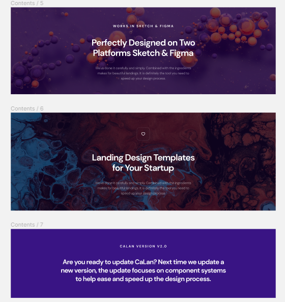

# Calan 

参照 Figma 设计稿进行编写的玩具项目，使用 styled-components 和 tailwindcss 进行开发。


提供三种响应式样式： sm， md 和 lg，其屏幕规范如下：

| Name | Width |
| --- | --- |
| lg | min-width: 1440px |
| md | min-width: 675px and max-width: 1440px |
| sm | max-width: 675px |

项目主要使用 styled-components 以 css-in-js 的形式编写组件，tailwindcss更多是做为一种简易的方式用于替代原本需要写在style属性里面的样式。

对 Calan 项目中对字体大小、行间距等属性做了一定的调整，在 ```utils/sizeTools``` 中提供了一系列工具函数，可以对不同尺寸的属性进行转换。
默认的转换规则为：
- 标题 依次为 1 3/4 1/2
- 描述，或者小标题 依次 -2px -4px
- 行间距逻辑和描述同理
- ......

---

# list

⭕ 写完默认 React 组件
⭕ 完成 demo
⭕ 设计 Json Schema 规范
⭕ 完成展示组件 DisplayBox 

---

# Dir
项目文件结构主要如下

| dir | desc |
| --- | --- |
| assets | 项目中可能用到的静态资源 |
| components | layout 中可能用到的组件 |
| func | demo项目，通过json生成 layout 网站组件 |
| layout | calan 组件展示页面框架 |
| pages | 分目录存放calan各个展示页面的组件 | 
| router | react-router-dom v6 路由配置文件 |
| utils | 工具类 |


# pages

pages 文件夹中分包存放各个组件，通过组件的拼接和修改可以快速搭建 layout 官网展示页面。
pages 文件夹下每个子文件中 ```index.js``` 文件默认为入口页面，其中通过 ```React.lazy``` 懒加载机制动态载入需要的文件
在路由中需要通过 ```/contents/01``` 这种 ```/文件夹/编号``` 的形式访问页面


pages 中每一个页面和 figma 设计稿中的页面完全对应，可能部分组件为了适配生成规则导致 css 样式略有出入。

**使用模板组件的时候需要拷贝组件的同时也需要把utils文件夹拷到自己的项目中！记得修改路径！**





# func

func 文件夹中存放一个简单的demo，可以通过提供规范的 json 快速生成官网 layout 组件，以便快速构建一个网站，
func 中的生成的 demo **完全使用js控制生成css样式**，可能造成一定的性能开销，目前还没什么时间优化。
其思路源自于我的 Envelope 项目，参考antd landing 和 doorxing 项目，目前还在编写中。

func 生成的组件会缺少一定的自由度，为了统一规范会限制一些接口，可能不方便后续调整。

func 中 component 文件夹中存放基础节点类，所有基础节点类都继承自 Wrapper 类，并且通过工厂类 Creator 进行创建，
之后会通过构造 CreatorBuilder 方式协助创建工厂类。

一个早期的 demo 规范如下：
```js
const dom  = {
    wrapper: {
        image: {},
        title: {
            class: '',
            text: 'Speed Up Your Design Process with CaLan',
            css: {
                fontWeight: 700,
                fontStyle: 'normal',
                color: '#12022F',
                letterSpacing: '-1.2px',
            },
            sm: {
            },
            default: {
                maxWidth: [740, 450, 345]
            }
        },
        text: {
            class:'',
            text: 'We\'ve done it carefully and simply. Combined with the ingredients makes for beautiful landings. It is definitely the tool you need to speed up your design process.',
            css:{

            },
            default: {

            },
        },
        wrapper: [
            {
                text: {}
            },
            {
                secondTitle: {},
                text: {}
            },
        ]
    }
}
```
其中 wrapper 相当于外层 div，内部的 title， desc， image 等对应每个基础节点类，通过递归解析 json ，并生成对应的 React 组件。
但是这样会导致不能生成同级 wrapper， 对于 grid 布局或者 flex 布局的网站很难处理。所以后续计划使用 Json Schema 定义规范。

# tailwind theme
计划中，calan 项目应该和 tailwindcss 高度捆绑，灵感 <del>抄</del> 源自于 daisyUI ,在参考项目中 tailwindcss 生成不同主题，
在 demo 项目中也写了一个用于参考的，之后和 Json Schema 捆绑，用于实现主题切换。

tailwind.config.js 文件中定义了 screens ，用于将 tailwindcss 默认的响应式和自己定义的媒体查询关联起来，不建议改动！
至于底下的 container 其实没怎么用，2.x 版本的 tailwindcss 的 container 默认表现不太行。


